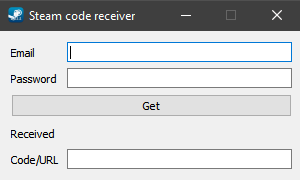

<h1><p align="center">Steam code receiver</p></h1>

<p align="center"></p>


<h1><p align="center">Content</p></h1>

- [Short description](#Short-description)
- [Useful links](#Useful-links)
- [How to run](#How-to-run)
    - [Windows](#Windows)
    - [Source code](#Source-code)
- [Report a bug or suggest an idea](#Report-a-bug-or-suggest-an-idea)
- [Express your gratitude](#Express-your-gratitude)


<h1><p align="center">Short description</p></h1>
<p align="right"><a href="#Content">To the content</a></p>

⠀The program allows you to receive Steam Guard codes from an email from the accounts on which the function is selected.

<p align="center"></p>

⠀An email must have enabled IMAP. The following email services are supported:
- [Gmail](https://www.gmail.com/)
- [Outlook](https://outlook.live.com/)
- [Rambler](https://mail.rambler.ru/)
- [Yandex](https://mail.yandex.ru/)


<h1><p align="center">Useful links</p></h1>
<p align="right"><a href="#Content">To the content</a></p>

⠀[Steam code receiver](https://github.com/SecorD0/steam-code-receiver)


<h1><p align="center">How to run</p></h1>
<p align="right"><a href="#Content">To the content</a></p>


<h2><p align="center">Windows</p></h2>

1. Download an EXE file from the [releases page](https://github.com/SecorD0/steam-code-receiver/releases); 
2. Run the program; 
3. Fill out the data:
   - Email;
   - Password.
4. Click the «Get» button;
5. If all goes well, you will receive a code or link to confirm the action in the «Code/URL» field and letter receiving date in the «Received» field.
6. Otherwise, you get one of the errors:
   - This email service isn't supported!
   - Wrong credentials!
   - No letter was found, try again!
   - Something else.

<h2><p align="center">Source code</p></h2>

1. Install [Python](https://www.python.org/downloads/);
2. Clone the repository:
```sh
git clone https://github.com/SecorD0/steam-code-receiver
```
3. Set up an environment;
4. Install requirements:
```sh
pip install -r requirements.txt
```
5. Run the `app.py`;
6. Fill out the data:
   - Email;
   - Password.
7. Click the «Get» button;
8. If all goes well, you will receive a code or link to confirm the action in the «Code/URL» field and letter receiving date in the «Received» field.
9. Otherwise, you get one of the errors:
   - This email service isn't supported!
   - Wrong credentials!
   - No letter was found, try again!
   - Something else.

⠀If you want to build the EXE file by yourself, use the command:
```sh
pyinstaller app.py -wFn steam-code-receiver -i images/icons/app.ico --add-binary "images/icons;images/icons"
```


<h1><p align="center">Report a bug or suggest an idea</p></h1>
<p align="right"><a href="#Content">To the content</a></p>

⠀If you found a bug or have an idea, go to [the link](https://github.com/SecorD0/steam-code-receiver/issues/new/choose), select the template, fill it out and submit it.


<h1><p align="center">Express your gratitude</p></h1>
<p align="right"><a href="#Content">To the content</a></p>

⠀You can express your gratitude to the developer by sending fund to crypto wallets!
- Ethereum-like address (Ethereum, BSC, Moonbeam, etc.): `0x900649087b8D7b9f799F880427DacCF2286D8F20`
- USDT TRC-20: `TNpBdjcmR5KzMVCBJTRYMJp16gCkQHu84K`
- SOL: `DoZpXzGj5rEZVhEVzYdtwpzbXR8ifk5bajHybAmZvR4H`
- BTC: `bc1qs4a0c3fntlhzn9j297qdsh3splcju54xscjstc`